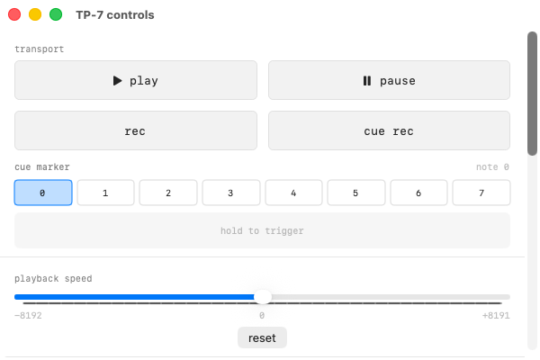
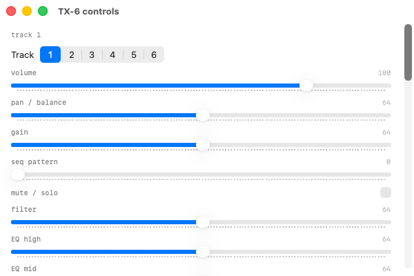
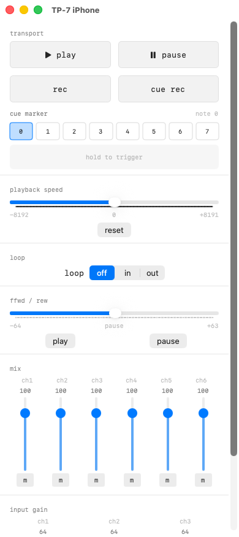
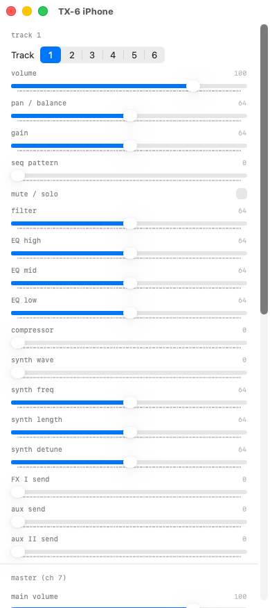

# field-remote

SwiftUI **BLE MIDI** remote for **Teenage Engineering** field gear: **TP-7** (recorder) and **TX-6** (mixer). Scan, connect, and use on-screen controls matched to each device. The app infers **TP-7** vs **TX-6** from the Bluetooth name when possible; you can pick a profile manually if the name is ambiguous.

Repository: [github.com/jwamin/field-remote](https://github.com/jwamin/field-remote)

## Screenshots

### macOS

| TP-7 | TX-6 |
|------|------|
|  |  |

### iPhone

| TP-7 | TX-6 |
|------|------|
|  |  |

## Requirements

- Xcode 16+ (project uses a recent SwiftUI / SDK; adjust deployment targets in Xcode if needed)
- iPhone, iPad, or Mac with Bluetooth
- A TP-7, TX-6, or other peripheral that exposes standard **BLE MIDI**

## Project layout

| Path | Role |
|------|------|
| `field-remote.xcodeproj` | Xcode project |
| `field-remote/BLEMIDIManager.swift` | CoreBluetooth central, BLE MIDI framing, TP-7 / TX-6 MIDI helpers |
| `field-remote/ContentView.swift` | Connection UI, device profile routing, TP-7 panels |
| `field-remote/TX6ControlsView.swift` | TX-6 control surface |
| `field-remote/DeviceProfile.swift` | `RemoteDeviceProfile` + name-based inference |
| `field-remote/MIDIAppIntents.swift` | Siri Shortcuts App Intents (CC, program change) |
| `field-remote/ShortcutMIDIBridge.swift` | Bridge between App Intents and BLE MIDI manager |
| `field-remote/FieldRemoteApp.swift` | App entry (`@main`) |

## Building

1. Open `field-remote.xcodeproj` in Xcode.
2. Select your development team for signing and ensure **Bluetooth** is allowed (app sandbox + usage string are set in the target).
3. Build and run on a **physical device** for real BLE hardware.

## BLE MIDI

The app uses the [MIDI over Bluetooth Low Energy](https://www.midi.org/specifications-old/item/bluetooth-le-midi) service (`03B80E5A-EDE8-4B33-A751-6CE34EC4C700`) and characteristic `7772E5DB-3868-4112-A1A9-F2669D106BF3`.

## Siri Shortcuts

The app exposes App Intents for Siri and the Shortcuts app:

- **Send CC** — send a MIDI Control Change message (controller 0–127, value 0–127)
- **Send Program Change** — switch program/patch (0–127)

## License

Unless you add a `LICENSE` file, all rights are reserved by the repository owner. Add a license if you intend to open-source under specific terms.
